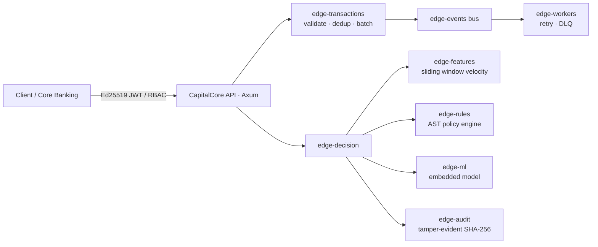

# CapitalCore — Real-Time Banking Decision & Fraud Operations Platform


CapitalCore is an enterprise-grade banking transaction decision engine and real-time fraud mitigation platform. It produces auditable, deterministic decisions (ALLOW, REVIEW, ESCALATE, BLOCK) across high-volume card, wire, and digital payments by uniting an AST rule engine, real-time sliding-window velocity aggregators, an embedded ML model (99.6% accuracy), and a tamper-evident SHA-256 cryptographic audit ledger.

---

## System Architecture



### Core Subsystems

| Crate | Responsibility |
| :--- | :--- |
| `edge-core`, `edge-domain` | Monetary types and enterprise banking domain model (zero I/O) |
| `edge-events`, `edge-audit` | Asynchronous event bus and append-only cryptographic audit log |
| `edge-transactions` | Ingestion, validation, channel normalization, deduplication |
| `edge-rules`, `edge-features` | AST rule evaluation and real-time sliding-window velocity aggregates |
| `edge-ml` | Embedded fraud model inference with sub-millisecond execution |
| `edge-decision` | Orchestration and deterministic policy arbitration |
| `edge-auth`, `edge-security` | Ed25519 asymmetric JWT, Argon2id, RBAC, secret scrubbing |
| `edge-storage` | SQLx / PostgreSQL audit repository with fallback buffer |
| `edge-workers` | Async worker pool, backpressure, exponential backoff, dead-letter queue |
| `edge-observability`, `edge-bench` | Tracing, Prometheus metrics, benchmark harness |
| `edge-api` | Axum HTTP REST API service |
| `apps/web` | Next.js Real-Time Fraud Operations & Decision Stream Console |

---

## API Reference

The CapitalCore API runs on port **8001** (or customizable via `PORT`):

| Method | Route | Description |
| :--- | :--- | :--- |
| `POST` | `/api/v1/transactions` | Submit transaction for real-time decisioning (ALLOW/REVIEW/ESCALATE/BLOCK) |
| `GET` | `/api/v1/decisions` | Stream recent decisions with status/channel filtering |
| `GET` | `/api/v1/decisions/stats` | Ingestion KPIs, block rates, escalation rates, and processed volumes |
| `GET` | `/api/v1/decisions/:id` | Detailed inspection of transaction decision, rules fired, and features |
| `GET` | `/api/v1/audit` | Recent tamper-evident audit records |
| `GET` | `/api/v1/audit/verify` | Verify cryptographic SHA-256 hash chain integrity |
| `GET` | `/api/v1/model` | Active ML model card, accuracy metrics, and feature catalog |
| `GET` | `/api/v1/auth/session` | Mint authenticated Ed25519 JWT session for Bank Risk Analyst |
| `GET` | `/health/liveness` | Service liveness probe |
| `GET` | `/health/readiness` | Service readiness probe |
| `GET` | `/metrics` | Prometheus telemetry |
| `GET` | `/openapi.json` | OpenAPI 3.0 specification |

---

## Local Execution & Development

### Standard Ports
- **Frontend Web UI**: `http://localhost:3001`
- **Rust Core API**: `http://localhost:8001`

### Running with Docker (All-In-One Unified Container)

Both the Rust Decision Engine and the Next.js Web Console can be launched together in a single container:

```bash
# Build the unified image
docker build -f Dockerfile.all-in-one -t capitalcore-all-in-one .

# Run container on ports 3001 (Web) and 8001 (API)
docker run -d --name capitalcore-unified \
  -p 3001:3001 \
  -p 8001:8001 \
  -e JWT_SECRET_SEED=$(openssl rand -hex 32) \
  capitalcore-all-in-one
```

Once running:
- **Operations Console**: [http://localhost:3001](http://localhost:3001)
- **Decision Engine API**: [http://localhost:8001/api/v1/decisions/stats](http://localhost:8001/api/v1/decisions/stats)
- **Liveness Probe**: [http://localhost:8001/health/liveness](http://localhost:8001/health/liveness)

---

## Deploying Frontend to Vercel

The Next.js web application is located at `apps/web` and ready for instant deployment:

1. **Root Directory**: `apps/web` (pre-configured in root [vercel.json](file:///c:/Users/damed/Downloads/edge-arena/vercel.json)).
2. **Framework Preset**: Next.js.
3. **Environment Variables**:
   - `NEXT_PUBLIC_API_URL`: URL of your deployed CapitalCore Rust API (e.g. `https://api.capitalcore.bank`).
4. **Deploy**:
   ```bash
   vercel
   ```
   Or link this repository to your Vercel team dashboard.

---

## Documentation

- [`docs/STATUS.md`](docs/STATUS.md) · Architecture and implementation review
- [`docs/adr/`](docs/adr) · Architecture Decision Records (Banking Decision Engine pivot)
- [`docs/benchmarks.md`](docs/benchmarks.md) · Ingestion throughput and latency benchmarks

---

## License

© 2026 CapitalCore Financial Technologies. All rights reserved.
