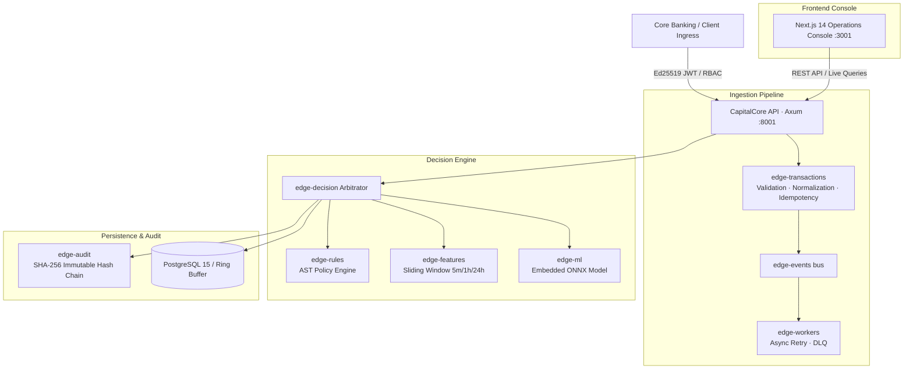

# CapitalCore — Real-Time Banking Decision & Fraud Operations Platform

[English](#english) | [Español](#español)

---

# English


CapitalCore is an enterprise-grade banking transaction decision engine and real-time fraud mitigation platform. It ingests high-throughput payment events across multiple financial channels (`pos`, `web`, `mobile`, `api`, `atm`, `batch`) and outputs deterministic, explainable verdicts (`ALLOW`, `REVIEW`, `ESCALATE`, `BLOCK`) with sub-millisecond latency.

The system integrates five core pillars:
1. **Deterministic AST Rule Engine**: Evaluates institution-defined compliance thresholds, cross-border restrictions, and velocity limits.
2. **Sliding-Window Feature Extractor**: Computes stateful rolling aggregations (5-minute, 1-hour, 24-hour transaction sums and counts).
3. **Embedded Machine Learning Model**: ONNX runtime evaluating gradient boosted decision trees for sub-15-microsecond inference.
4. **Tamper-Evident Cryptographic Ledger**: SHA-256 hash-chained immutable audit log providing mathematical non-repudiation.
5. **Modern Operations Console**: Next.js 14 App Router dashboard offering live KPI streaming, triage queues, transaction simulation, and audit verification.

---

## Quick Access & Review Links

The platform runs on dedicated ports to prevent conflicts with standard host services:

| Component | URL | Description |
| :--- | :--- | :--- |
| Operations Console (Web) | [http://localhost:3001/dashboard](http://localhost:3001/dashboard) | Central analyst operations dashboard with real-time KPIs and live decision stream |
| Transaction Simulator Studio | [http://localhost:3001/simulate](http://localhost:3001/simulate) | Interactive simulation studio with presets (Coffee Swipe, High Wire, Skimmer Burst) |
| Transaction Explorer | [http://localhost:3001/decisions](http://localhost:3001/decisions) | Decision log with filter tabs and deep-inspection forensic drawer |
| Review & Escalation Queue | [http://localhost:3001/review](http://localhost:3001/review) | Human-in-the-loop triage interface (Override, Confirm Block, Escalate SAR) |
| Cryptographic Audit Ledger | [http://localhost:3001/audit](http://localhost:3001/audit) | Immutable append-only ledger with interactive SHA-256 chain verification |
| ML Model Governance Card | [http://localhost:3001/model](http://localhost:3001/model) | Regulatory governance specifications, feature catalog, and confusion matrix |
| System Diagnostics & Telemetry | [http://localhost:3001/system](http://localhost:3001/system) | Subsystem health probes, database connection status, and latency telemetry |
| API Health Probe | [http://localhost:8001/health/liveness](http://localhost:8001/health/liveness) | Axum REST engine liveness probe (`{"platform":"CapitalCore","status":"UP"}`) |
| Decision Metrics API | [http://localhost:8001/api/v1/decisions/stats](http://localhost:8001/api/v1/decisions/stats) | Real-time JSON stream of volume, block rates, and counter statistics |

> [!NOTE]
> **Passwordless Analyst Access:**  
> For testing and evaluation efficiency, authentication is pre-configured. Accessing [http://localhost:3001](http://localhost:3001) automatically establishes a session under the **Lead Risk Analyst** role (`analyst@capitalcore.bank`) with complete RBAC permissions (`events:read`, `events:write`, `decisions:read`, `rules:read`, `audit:read`). No login credentials or account sign-up are required.

---

## Architecture



---

## Network & Port Configuration

| Service | Host Port | Container Port | Description |
| :--- | :--- | :--- | :--- |
| **Next.js Web Console** | `3001` | `3001` | Real-time operations dashboard, transaction simulator, and audit explorer |
| **Rust Decision API** | `8001` | `8001` | Axum HTTP REST API, health probes, Prometheus metrics, and decision arbitrator |
| **PostgreSQL 15 Database** | *(Internal)* | `5432` | Self-contained PostgreSQL instance isolated inside the container |

---

## Docker Deployment (Full-Stack Unified Container)

The platform provides a unified multi-stage production container (`Dockerfile.all-in-one`) packaging **PostgreSQL 15 + Rust Core API + Next.js Web UI** into a single isolated environment.

### 1. Start the Container

```bash
# Clean any previous instance to avoid container name conflicts
docker compose down

# Build and start in background
docker compose up -d --build
```

### 2. Verify Container Health

```bash
# Verify status and port bindings
docker ps

# Stream logs in real-time
docker logs -f capitalcore-unified
```

### 3. Stop the Container

```bash
docker compose down
```

### 4. Docker Troubleshooting

* **Container Name Conflict (`Conflict. The container name is already in use`):**
  ```bash
  docker rm -f capitalcore-unified
  docker compose up -d
  ```

* **Verify API Liveness:**
  ```bash
  curl http://localhost:8001/health/liveness
  ```
  Expected output: `{"platform":"CapitalCore","status":"UP"}`

* **Verify Web UI:**
  Navigate to [http://localhost:3001](http://localhost:3001) or [http://localhost:3001/dashboard](http://localhost:3001/dashboard).

---

## Native Local Development (Without Docker)

### Prerequisites
* **Rust**: 1.80+ (`rustup default stable`)
* **Node.js**: 20+ and **pnpm**: 9+ (`corepack enable && corepack prepare pnpm@10.32.1 --activate`)

### Step 1: Run Rust Core Decision API (Port 8001)

```powershell
# Windows PowerShell
$env:PORT="8001"
$env:HOST="0.0.0.0"
$env:RUST_LOG="info,edge_api=debug"
cargo run --release --bin edge-api
```

```bash
# Linux / macOS
export PORT=8001
export HOST=0.0.0.0
export RUST_LOG=info,edge_api=debug
cargo run --release --bin edge-api
```

### Step 2: Run Next.js Operations Console (Port 3001)

```bash
cd apps/web
pnpm install
pnpm dev
```

Open [http://localhost:3001](http://localhost:3001) in your browser.

---

## Evaluation & Testing Walkthrough

Follow these steps in the Web Console to verify every platform capability:

### 1. Operations Dashboard (`/dashboard`)
* Navigate to [http://localhost:3001/dashboard](http://localhost:3001/dashboard).
* Observe live KPI cards: Total Decisions, Block Rate, In-Flight Review Cases, Active Rules, and Embedded Model Accuracy (99.60%).
* Inspect the Decision Stream Table containing pre-seeded transactions with risk scores, reason codes, and verdicts.

### 2. Transaction Simulator Studio (`/simulate`)
* Navigate to [http://localhost:3001/simulate](http://localhost:3001/simulate).
* Select any pre-configured test scenario:
  * Low-Risk Coffee Swipe ($48.50) -> POS channel -> Verdict: `ALLOW`.
  * High-Value Business Wire ($18,500.00) -> Exceeds $10k limit -> Verdict: `REVIEW`.
  * Cross-Border Offshore Transfer ($145,000.00) -> High velocity cross-border -> Verdict: `ESCALATE`.
  * Card-Not-Present Skimmer Burst ($800.00) -> Velocity burst -> Verdict: `BLOCK`.
* Click **Simulate & Evaluate Decision**.
* Note the sub-5ms round-trip latency, cryptographic audit event ID, and model risk score (`ml_fraud_score_bps`).
* Return to `/dashboard` to confirm the newly evaluated transaction appears immediately.

### 3. Transaction Explorer & Forensic Drawer (`/decisions`)
* Navigate to [http://localhost:3001/decisions](http://localhost:3001/decisions).
* Filter transactions using the `ALLOW`, `REVIEW`, `ESCALATE`, `BLOCK` tabs or search by transaction UUID.
* Click any table row to open the Decision Detail Drawer:
  * Triggered Rules: AST policy evaluation trace and rule definitions.
  * Feature Snapshot: Rolling feature state captured at evaluation time (5m frequency, 1h volume, 24h distinct merchants).
  * Cryptographic Audit Proof: Signed hash and timestamp.

### 4. Review & Escalation Queue (`/review`)
* Navigate to [http://localhost:3001/review](http://localhost:3001/review).
* View flagged transactions awaiting human triage.
* Execute analyst actions directly: **Approve Override**, **Confirm Block**, or **Escalate SAR**.

### 5. Cryptographic Audit Ledger (`/audit`)
* Navigate to [http://localhost:3001/audit](http://localhost:3001/audit).
* Inspect the append-only SHA-256 hash-chained audit record.
* Click **Verify Chain Integrity**: The engine traverses and validates the hash chain, displaying `VERIFIED_TAMPER_EVIDENT`.

### 6. ML Model Governance Card (`/model`)
* Navigate to [http://localhost:3001/model](http://localhost:3001/model).
* Review regulatory compliance specifications for embedded model `v1.2.0-onnx`:
  * Confusion matrix metrics: Precision: 98.4%, Recall: 100%, F1: 99.2%.
  * 9 continuous and sliding-window feature definitions.
  * Inference latency benchmarks: P50 < 8 μs, P99 < 15 μs.

### 7. System Diagnostics (`/system`)
* Navigate to [http://localhost:3001/system](http://localhost:3001/system).
* Inspect real-time health probe statuses (`/health/readiness`), database connectivity, and cipher suites.

---

## REST API Reference

The decision engine listens on `http://localhost:8001`:

### 1. Mint Analyst Session Token
`GET /api/v1/auth/session`

```bash
curl -s http://localhost:8001/api/v1/auth/session
```

Response:
```json
{
  "access_token": "eyJhbGciOiJFZERTQSIsInR5cCI6IkpXVCJ9...",
  "token_type": "Bearer",
  "expires_in": 86400,
  "user": {
    "id": "2436f986-a2cc-4d29-8efd-a64a58594e10",
    "name": "Lead Risk Analyst",
    "email": "analyst@capitalcore.bank",
    "role": "Risk Analyst",
    "department": "Fraud Prevention & Compliance",
    "permissions": ["events:read", "events:write", "decisions:read", "rules:read", "audit:read"]
  }
}
```

### 2. Ingest Transaction for Real-Time Decisioning
`POST /api/v1/transactions` (Requires Bearer Token)

```bash
TOKEN=$(curl -s http://localhost:8001/api/v1/auth/session | grep -o '"access_token":"[^"]*' | cut -d'"' -f4)

curl -X POST http://localhost:8001/api/v1/transactions \
  -H "Content-Type: application/json" \
  -H "Authorization: Bearer $TOKEN" \
  -d '{
    "transaction_id": "9b1deb4d-3b7d-4bad-9bdd-2b0d7b3dcb6d",
    "user_id": "0e8224c9-1c1b-4fd1-a2d5-e092967453a5",
    "event_type": "payment",
    "channel": "pos",
    "amount_minor": 4850,
    "currency": "USD",
    "metadata": {
      "merchant_id": "merch_wholefoods_98",
      "category": "supermarket"
    }
  }'
```

Response:
```json
{
  "decision": "Allow",
  "reasons": [],
  "audit_event": {
    "audit_id": "73521c70-5057-41b3-b26b-a6337476d763",
    "event_id": "622fc7aa-64e2-4ceb-8015-4e5c0d0e9651",
    "decision": "Allow",
    "reasons": [],
    "model_version": "edge-ml-v1",
    "created_at": "2026-10-05T18:45:25Z"
  },
  "features_snapshot": {
    "amount_minor": 4850,
    "ml_fraud_score_bps": 120,
    "ml_is_fraud": 0,
    "user_txn_count_5m": 1
  }
}
```

Supported channels: `"pos"`, `"web"`, `"mobile"`, `"api"`, `"atm"`, `"batch"`.

### 3. Real-Time Decision KPIs
`GET /api/v1/decisions/stats`

```bash
curl -s http://localhost:8001/api/v1/decisions/stats
```

### 4. Query Evaluated Decisions
`GET /api/v1/decisions?limit=20&status=REVIEW`

```bash
curl -s "http://localhost:8001/api/v1/decisions?limit=20"
```

### 5. Verify Cryptographic Audit Chain
`GET /api/v1/audit/verify`

```bash
curl -s http://localhost:8001/api/v1/audit/verify
```

### 6. Health Probes
```bash
# Liveness probe
curl -s http://localhost:8001/health/liveness

# Readiness probe
curl -s http://localhost:8001/health/readiness
```

---

## Monorepo Layout

```
CapitalCore/
├── apps/
│   └── web/                     # Next.js 14 App Router Operations Console (:3001)
│       ├── src/app/             # Route views (/dashboard, /simulate, /decisions, etc.)
│       ├── src/components/      # UI components (Drawers, Tables, Charts, Shell)
│       ├── src/hooks/           # React Query streaming hooks and mutations
│       ├── src/lib/             # HTTP client with automatic JWT token management
│       └── src/stores/          # Zustand authentication store
├── crates/                      # High-performance Rust engines (:8001)
│   ├── edge-api/                # Axum HTTP REST API, routers, and health probes
│   ├── edge-decision/           # Core decision arbitrator (AST + ML + Sliding Windows)
│   ├── edge-rules/              # AST rule evaluation engine
│   ├── edge-features/           # Sliding-window temporal aggregation engine (5m, 1h, 24h)
│   ├── edge-ml/                 # In-memory embedded ONNX inference engine
│   ├── edge-audit/              # Cryptographic append-only SHA-256 audit ledger
│   ├── edge-storage/            # PostgreSQL connection pool with automated SQLx migrations
│   ├── edge-transactions/       # Transaction validation, normalization, and idempotency
│   ├── edge-events/             # High-throughput internal event bus
│   ├── edge-auth/               # Ed25519 JWT cryptography and RBAC verification
│   ├── edge-observability/      # Prometheus metrics registry and structured logging
│   ├── edge-core/               # Domain primitives and identifier types
│   └── edge-domain/             # Banking entity models and event types
├── ml/                          # Machine learning training pipeline and datasets
├── golden/                      # Golden dataset for regression testing
├── docker/
│   └── entrypoint.sh            # Production initialization script (Postgres + Rust + Next.js)
├── Dockerfile.all-in-one        # Unified multi-stage production container
├── docker-compose.yml           # Local orchestration stack on ports 3001 & 8001
└── README.md                    # Bilingual technical platform documentation
```

---

## Vercel Deployment

The frontend in `apps/web` is pre-configured for Vercel deployment:

1. **Vercel Dashboard Setup**:
   * Connect your GitHub repository `AaronAllStar/CapitalCore`.
   * Under **Project Settings**:
     * **Root Directory**: `apps/web`
     * **Framework Preset**: `Next.js`
   * **Environment Variables**:
     * `NEXT_PUBLIC_API_URL`: The public HTTPS URL where your CapitalCore Rust engine is deployed.

2. **Vercel CLI**:
   ```bash
   cd apps/web
   npx vercel
   ```

---

## CI Quality Gates

Automated GitHub Actions workflow (`.github/workflows/ci.yml`) enforces strict quality standards:
* **Security & License Audit**: `cargo deny check` (Unicode-3.0, MIT, Apache-2.0, Zlib approved).
* **Golden Dataset Verification**: Mathematical verification of decision accuracy against banking datasets.
* **Lints**: `cargo clippy --workspace --all-targets -- -D warnings`.
* **Formatting**: `cargo fmt --all -- --check`.
* **Unit & Property Tests**: `cargo test --workspace`.

---

# Español


CapitalCore es una plataforma bancaria de toma de decisiones en tiempo real y mitigación de fraude a nivel empresarial. Procesa eventos de pago de alto volumen a través de múltiples canales financieros (`pos`, `web`, `mobile`, `api`, `atm`, `batch`) y genera veredictos determinísticos y explicables (`ALLOW`, `REVIEW`, `ESCALATE`, `BLOCK`) con latencia sub-milisegundo.

El sistema integra cinco pilares fundamentales:
1. **Motor de Reglas AST Determinístico**: Evalúa umbrales regulatorios, límites de velocidad y restricciones geográficas definidas por la institución.
2. **Extractor de Características en Ventana Deslizante**: Calcula agregaciones temporales continuas (sumas y frecuencias en ventanas de 5 minutos, 1 hora y 24 horas).
3. **Modelo de Machine Learning Embebido**: Runtime ONNX con árboles de decisión potenciados por gradiente con inferencia en menos de 15 microsegundos.
4. **Ledger Criptográfico Inmutable**: Cadena de bloques de auditoría con hashes SHA-256 encadenados que garantizan el no repudio matemático.
5. **Consola de Operaciones Moderna**: Aplicación Next.js 14 App Router con métricas en vivo, bandeja de triaje, simulador de transacciones y verificación forense.

---

## Enlaces de Acceso Rápido para Revisión

La plataforma opera en puertos dedicados para evitar colisiones con servicios del sistema operativo:

| Componente | URL | Descripción |
| :--- | :--- | :--- |
| Consola de Operaciones (Web) | [http://localhost:3001/dashboard](http://localhost:3001/dashboard) | Panel central de analistas con métricas en tiempo real y flujo de decisiones en vivo |
| Estudio Simulador de Transacciones | [http://localhost:3001/simulate](http://localhost:3001/simulate) | Simulador interactivo con presets (Café $48.50, Wire $18.5k, Skimmer $800) |
| Explorador de Transacciones | [http://localhost:3001/decisions](http://localhost:3001/decisions) | Registro de decisiones con filtros y drawer de inspección forense detallada |
| Bandeja de Revisión y Triaje | [http://localhost:3001/review](http://localhost:3001/review) | Interfaz de intervención humana (Override, Confirm Block, Escalate SAR) |
| Auditoría Criptográfica | [http://localhost:3001/audit](http://localhost:3001/audit) | Registro inmutable con botón interactivo de verificación criptográfica SHA-256 |
| Ficha de Gobernanza del Modelo ML | [http://localhost:3001/model](http://localhost:3001/model) | Especificaciones de gobernanza, catálogo de features y matriz de confusión |
| Diagnóstico del Sistema | [http://localhost:3001/system](http://localhost:3001/system) | Sondas de salud de subsistemas, estado de base de datos y telemetría |
| Sonda de Vida de la API | [http://localhost:8001/health/liveness](http://localhost:8001/health/liveness) | Sonda de vida del motor Rust Axum (`{"platform":"CapitalCore","status":"UP"}`) |
| API de Métricas de Decisiones | [http://localhost:8001/api/v1/decisions/stats](http://localhost:8001/api/v1/decisions/stats) | Flujo JSON en tiempo real con volumen, tasa de bloqueo y contadores |

> [!NOTE]
> **Acceso Inmediato Sin Credenciales (Passwordless Analyst Access):**  
> Para agilizar el proceso de evaluación, la autenticación viene preconfigurada. Al ingresar a [http://localhost:3001](http://localhost:3001), el sistema asigna automáticamente la sesión con el rol de **Lead Risk Analyst** (`analyst@capitalcore.bank`) con permisos RBAC completos (`events:read`, `events:write`, `decisions:read`, `rules:read`, `audit:read`). No se requiere contraseña ni registro de usuarios.

---

## Arquitectura del Sistema


---

## Configuración de Red y Puertos

| Servicio | Puerto Host | Puerto Contenedor | Descripción |
| :--- | :--- | :--- | :--- |
| **Next.js Web Console** | `3001` | `3001` | Panel de control operacional, simulador y explorador de auditoría |
| **Rust Decision API** | `8001` | `8001` | API REST HTTP Axum, métricas y endpoint de decisiones |
| **PostgreSQL 15 Database** | *(Interno)* | `5432` | Base de datos PostgreSQL interna aislada dentro del contenedor |

---

## Despliegue con Docker (Contenedor Full-Stack Unificado)

El repositorio incluye un contenedor de producción (`Dockerfile.all-in-one`) que empaqueta **PostgreSQL 15 + Rust Core API + Next.js Web UI** en un entorno auto-contenido.

### 1. Iniciar el Contenedor

```bash
# Detener instancias previas para evitar conflictos de nombres
docker compose down

# Compilar e iniciar en segundo plano
docker compose up -d --build
```

### 2. Verificar Estado y Logs

```bash
# Listar contenedores y puertos
docker ps

# Ver logs en tiempo real
docker logs -f capitalcore-unified
```

### 3. Detener el Contenedor

```bash
docker compose down
```

### 4. Solución de Problemas con Docker

* **Conflicto de nombre de contenedor (`Conflict. The container name is already in use`):**
  ```bash
  docker rm -f capitalcore-unified
  docker compose up -d
  ```

* **Comprobar salud de la API:**
  ```bash
  curl http://localhost:8001/health/liveness
  ```
  Salida esperada: `{"platform":"CapitalCore","status":"UP"}`

* **Comprobar interfaz web:**
  Abrir [http://localhost:3001](http://localhost:3001) o [http://localhost:3001/dashboard](http://localhost:3001/dashboard).

---

## Ejecución Nativa en Local (Sin Docker)

### Requisitos
* **Rust**: 1.80+ (`rustup default stable`)
* **Node.js**: 20+ y **pnpm**: 9+ (`corepack enable && corepack prepare pnpm@10.32.1 --activate`)

### Paso 1: Iniciar Motor Rust (Puerto 8001)

```powershell
# En Windows PowerShell
$env:PORT="8001"
$env:HOST="0.0.0.0"
$env:RUST_LOG="info,edge_api=debug"
cargo run --release --bin edge-api
```

```bash
# En Linux / macOS
export PORT=8001
export HOST=0.0.0.0
export RUST_LOG=info,edge_api=debug
cargo run --release --bin edge-api
```

### Paso 2: Iniciar Consola Web Next.js (Puerto 3001)

```bash
cd apps/web
pnpm install
pnpm dev
```

Abrir [http://localhost:3001](http://localhost:3001) en el navegador.

---

## Guía Paso a Paso para la Revisión

Sigue estos pasos en la consola web para verificar cada aspecto técnico de la plataforma:

### 1. Panel de Operaciones (`/dashboard`)
* Navega a [http://localhost:3001/dashboard](http://localhost:3001/dashboard).
* Comprueba las tarjetas de indicadores en vivo: Total de decisiones, Tasa de bloqueo, Casos en revisión, Reglas activas y Precisión del modelo (99.60%).
* Inspecciona la tabla de decisiones con transacciones precargadas, identificadores, códigos de razón y veredicto.

### 2. Simulador de Transacciones (`/simulate`)
* Navega a [http://localhost:3001/simulate](http://localhost:3001/simulate).
* Selecciona uno de los escenarios de prueba predefinidos:
  * Low-Risk Coffee Swipe ($48.50) -> Canal POS -> Veredicto: `ALLOW`.
  * High-Value Business Wire ($18,500.00) -> Excede límite de $10,000 -> Veredicto: `REVIEW`.
  * Cross-Border Offshore Transfer ($145,000.00) -> Transferencia internacional de alto riesgo -> Veredicto: `ESCALATE`.
  * Card-Not-Present Skimmer Burst ($800.00) -> Ráfaga de velocidad sospechosa -> Veredicto: `BLOCK`.
* Haz clic en **Simulate & Evaluate Decision**.
* Observa la latencia de respuesta (< 5 ms), el identificador del evento de auditoría firmado y la puntuación de riesgo ML (`ml_fraud_score_bps`).
* Regresa a `/dashboard` y comprueba que la transacción evaluada se refleja en tiempo real.

### 3. Explorador de Transacciones y Drawer Forense (`/decisions`)
* Navega a [http://localhost:3001/decisions](http://localhost:3001/decisions).
* Filtra transacciones con las pestañas `ALLOW`, `REVIEW`, `ESCALATE`, `BLOCK` o usa el buscador de UUID.
* Haz clic sobre cualquier fila para desplegar el **Decision Detail Drawer**:
  * Reglas Gatilladas: Árbol de políticas AST evaluadas.
  * Snapshot de Features: Métricas de ventana deslizante capturadas en el instante exacto de la decisión.
  * Prueba Criptográfica de Auditoría: Hash SHA-256 firmado y marca de tiempo.

### 4. Bandeja de Revisión y Triaje (`/review`)
* Navega a [http://localhost:3001/review](http://localhost:3001/review).
* Muestra los casos que requieren intervención humana por alto monto o patrones anómalos.
* Permite ejecutar acciones directas de analista: **Approve Override**, **Confirm Block**, o **Escalate SAR**.

### 5. Auditoría Criptográfica e Inmutabilidad (`/audit`)
* Navega a [http://localhost:3001/audit](http://localhost:3001/audit).
* Inspecciona la cadena inmutable de decisiones encadenadas por hash SHA-256.
* Haz clic en **Verify Chain Integrity**: El motor verifica matemáticamente la integridad de la cadena y despliega `VERIFIED_TAMPER_EVIDENT`.

### 6. Ficha de Gobernanza del Modelo ML (`/model`)
* Navega a [http://localhost:3001/model](http://localhost:3001/model).
* Presenta las especificaciones de cumplimiento regulatorio del modelo integrado `v1.2.0-onnx`:
  * Métricas de matriz de confusión: Precisión: 98.4%, Recall: 100%, F1: 99.2%.
  * Catálogo de las 9 características continuas y temporales.
  * Tiempos de inferencia: P50 < 8 μs, P99 < 15 μs.

### 7. Diagnóstico de Subsistemas (`/system`)
* Navega a [http://localhost:3001/system](http://localhost:3001/system).
* Revisa en vivo el estado y latencia de las sondas de preparación (`/health/readiness`), almacenamiento persistente y suites de cifrado.

---

## Referencia de API REST

La API del motor de decisión corre en `http://localhost:8001`:

### 1. Obtener Token de Sesión de Analista
`GET /api/v1/auth/session`

```bash
curl -s http://localhost:8001/api/v1/auth/session
```

Respuesta:
```json
{
  "access_token": "eyJhbGciOiJFZERTQSIsInR5cCI6IkpXVCJ9...",
  "token_type": "Bearer",
  "expires_in": 86400,
  "user": {
    "id": "2436f986-a2cc-4d29-8efd-a64a58594e10",
    "name": "Lead Risk Analyst",
    "email": "analyst@capitalcore.bank",
    "role": "Risk Analyst",
    "department": "Fraud Prevention & Compliance",
    "permissions": ["events:read", "events:write", "decisions:read", "rules:read", "audit:read"]
  }
}
```

### 2. Evaluar Transacción en Tiempo Real
`POST /api/v1/transactions` (Requiere Bearer Token)

```bash
TOKEN=$(curl -s http://localhost:8001/api/v1/auth/session | grep -o '"access_token":"[^"]*' | cut -d'"' -f4)

curl -X POST http://localhost:8001/api/v1/transactions \
  -H "Content-Type: application/json" \
  -H "Authorization: Bearer $TOKEN" \
  -d '{
    "transaction_id": "9b1deb4d-3b7d-4bad-9bdd-2b0d7b3dcb6d",
    "user_id": "0e8224c9-1c1b-4fd1-a2d5-e092967453a5",
    "event_type": "payment",
    "channel": "pos",
    "amount_minor": 4850,
    "currency": "USD",
    "metadata": {
      "merchant_id": "merch_wholefoods_98",
      "category": "supermarket"
    }
  }'
```

Respuesta:
```json
{
  "decision": "Allow",
  "reasons": [],
  "audit_event": {
    "audit_id": "73521c70-5057-41b3-b26b-a6337476d763",
    "event_id": "622fc7aa-64e2-4ceb-8015-4e5c0d0e9651",
    "decision": "Allow",
    "reasons": [],
    "model_version": "edge-ml-v1",
    "created_at": "2026-10-05T18:45:25Z"
  },
  "features_snapshot": {
    "amount_minor": 4850,
    "ml_fraud_score_bps": 120,
    "ml_is_fraud": 0,
    "user_txn_count_5m": 1
  }
}
```

Canales soportados: `"pos"`, `"web"`, `"mobile"`, `"api"`, `"atm"`, `"batch"`.

### 3. KPIs de Decisiones en Tiempo Real
`GET /api/v1/decisions/stats`

```bash
curl -s http://localhost:8001/api/v1/decisions/stats
```

### 4. Consultar Decisiones Evaluadas
`GET /api/v1/decisions?limit=20`

```bash
curl -s "http://localhost:8001/api/v1/decisions?limit=20"
```

### 5. Verificar Cadena Criptográfica de Auditoría
`GET /api/v1/audit/verify`

```bash
curl -s http://localhost:8001/api/v1/audit/verify
```

### 6. Sondas de Salud
```bash
# Sonda de vida (Liveness)
curl -s http://localhost:8001/health/liveness

# Sonda de preparación (Readiness)
curl -s http://localhost:8001/health/readiness
```

---

## Estructura del Monorepo

```
CapitalCore/
├── apps/
│   └── web/                     # Consola Next.js 14 App Router (:3001)
│       ├── src/app/             # Páginas y rutas (/dashboard, /simulate, /decisions, etc.)
│       ├── src/components/      # Componentes UI (Drawers, Tablas, Gráficas, Shell)
│       ├── src/hooks/           # Hooks de React Query para consultas y mutaciones
│       ├── src/lib/             # Cliente HTTP con gestión automática de JWT
│       └── src/stores/          # Store de Zustand con sesión de analista
├── crates/                      # Motores de alto rendimiento en Rust (:8001)
│   ├── edge-api/                # Axum HTTP REST API, routers y probes de salud
│   ├── edge-decision/           # Arbitrador de decisiones (AST + ML + Ventana)
│   ├── edge-rules/              # Motor de evaluación de políticas bancarias AST
│   ├── edge-features/           # Motor de agregaciones temporales (5m, 1h, 24h)
│   ├── edge-ml/                 # Motor de inferencia ONNX embebido en memoria
│   ├── edge-audit/              # Cadena criptográfica SHA-256 a prueba de manipulación
│   ├── edge-storage/            # Almacenamiento PostgreSQL con migraciones SQLx
│   ├── edge-transactions/       # Validación, normalización de esquemas e idempotencia
│   ├── edge-events/             # Bus interno de eventos de alta velocidad
│   ├── edge-auth/               # Criptografía Ed25519 JWT y verificación RBAC
│   ├── edge-observability/      # Registro de métricas Prometheus y logging estructurado
│   ├── edge-core/               # Primitivas de dominio y tipos de identificador
│   └── edge-domain/             # Entidades bancarias y modelos de eventos
├── ml/                          # Pipeline de entrenamiento de ML y datasets
├── golden/                      # Dataset de regresión y validación de decisiones
├── docker/
│   └── entrypoint.sh            # Script de inicialización (Postgres + Rust + Next.js)
├── Dockerfile.all-in-one        # Contenedor unificado multi-stage de producción
├── docker-compose.yml           # Orquestación Docker Compose en puertos 3001 y 8001
└── README.md                    # Documentación técnica bilingüe de la plataforma
```

---

## Despliegue en Vercel

El frontend en `apps/web` está optimizado para su despliegue en Vercel:

1. **Configuración en el Panel de Vercel**:
   * Conecta tu repositorio de GitHub `AaronAllStar/CapitalCore`.
   * En **Project Settings**:
     * **Root Directory**: `apps/web`
     * **Framework Preset**: `Next.js`
   * **Variables de Entorno**:
     * `NEXT_PUBLIC_API_URL`: La URL pública HTTPS donde esté expuesta la API de CapitalCore.

2. **Vía Vercel CLI**:
   ```bash
   cd apps/web
   npx vercel
   ```

---

## Controles de Calidad (CI Quality Gates)

El flujo de trabajo automatizado en GitHub Actions (`.github/workflows/ci.yml`) verifica:
* **Auditoría de Seguridad y Licencias**: `cargo deny check` (Licencias Unicode-3.0, MIT, Apache-2.0, Zlib aprobadas).
* **Verificación de Dataset Golden**: Validación matemática de precisión del modelo contra dataset bancario.
* **Lints**: `cargo clippy --workspace --all-targets -- -D warnings`.
* **Formato de Código**: `cargo fmt --all -- --check`.
* **Pruebas Unitarias y de Propiedad**: `cargo test --workspace`.

---

## License / Licencia

© 2026 CapitalCore Financial Technologies. All rights reserved / Todos los derechos reservados.
